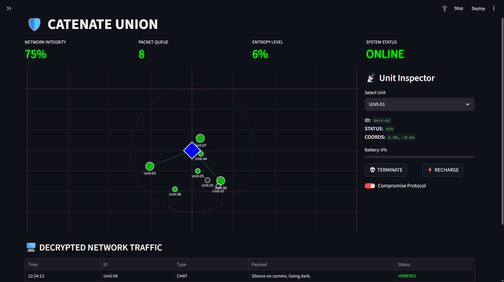
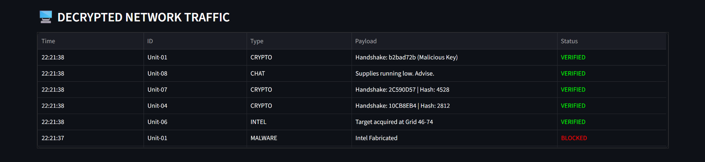
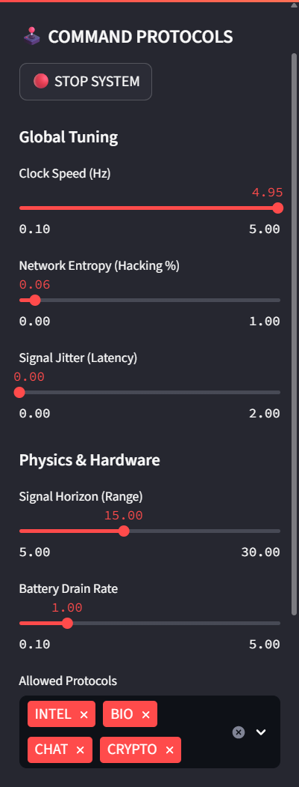
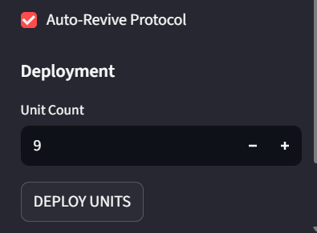
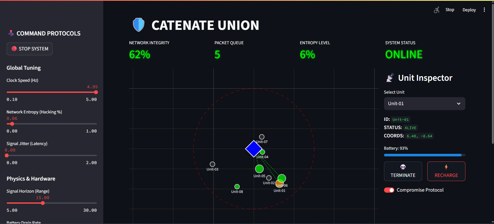
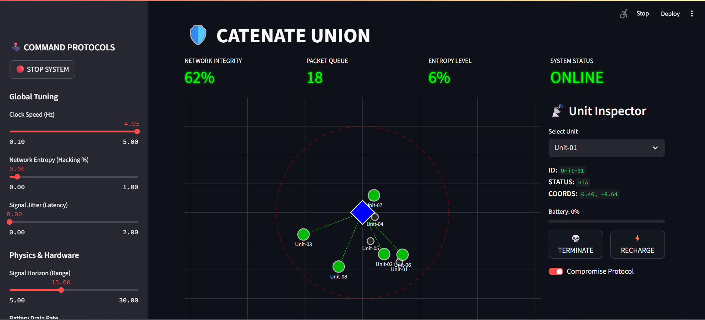
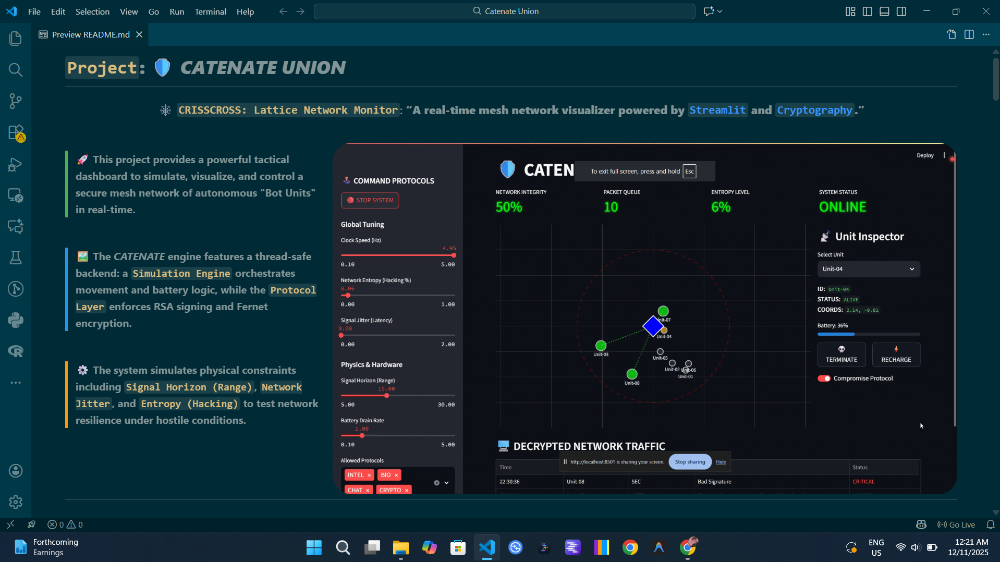

# **`Project`: 🛡️ _CATENATE UNION_**
<div align="center">

### 🕸️ `CRISSCROSS: Lattice Network Monitor`: **“A real-time mesh network visualizer powered by [`Streamlit`](https://streamlit.io/) and [`Cryptography`](https://cryptography.io/).”** <br>

</div>

<br>


<div style="border-left: 4px solid #4CAF50; padding-left: 12px; margin: 12px 0; font-size: 16px;">
🚀 <b>This project provides a powerful tactical dashboard to simulate, visualize, and control a secure mesh network of autonomous "Bot Units" in real-time.</b>
</div>

<br>

<div style="border-left: 4px solid #2196F3; padding-left: 12px; margin: 12px 0; font-size: 16px;">
🖼️ <b>The <i>CATENATE</i> engine features a thread-safe backend: a <code>Simulation Engine</code> orchestrates movement and battery logic, while the <code>Protocol Layer</code> enforces RSA signing and Fernet encryption.</b>
</div>

<br>

<div style="border-left: 4px solid #FF9800; padding-left: 12px; margin: 12px 0; font-size: 16px;">
⚙️ <b>The system simulates physical constraints including <code>Signal Horizon (Range)</code>, <code>Network Jitter</code>, and <code>Entropy (Hacking)</code> to test network resilience under hostile conditions.</b>
</div>

<div style="clear: both;"></div>

---

<br>

<div align="left">

# 🗂️ Project Structure

<br>

</div>

```markdown-tree
📁 CATENATE_UNION/
├── app.py                         
├── requirements.txt               
└── README.md                      
|
├── 📁 kernel/                      
│   ├── simulation_engine.py        
│   ├── state_manager.py            
│   └── __init__.py                 
│
├── 📁 interface/                   
│   ├── ui_components.py            
│   └── __init__.py                 
│
└── 📁 protocols/                   
    ├── core.py                    
    ├── network_extensions.py       
    └── __init__.py                 
```

<br>

<div align="left">

# ⚙️ **Features & Parameters**

</div>

---

<div align="left"; style="display: flex; align-items: flex-start; justify-content: space-between; gap: 30px; flex-wrap: wrap;">

  <!-- LEFT SIDE -->
  <div style="flex: 1; min-width: 320px;">

  <h3>🕹️ <b>Simulation Protocols</b></h3>

  <ul>
    <li><b>Clock Speed (Hz)</b> — Control the time dilation of the simulation; speed up or slow down packet transmission.</li>
    <li><b>Signal Horizon</b> — Adjust the physical maximum range for radio comms. Units outside this circle cannot transmit.</li>
    <li><b>Network Entropy</b> — Inject chaos into the system. Higher % increases the chance of nodes being compromised by malware.</li>
    <li><b>Battery Drain Mod</b> — Tune the hardware efficiency. Higher values force frequent manual recharges.</li>
  </ul>

  <h3>🎨 <b>Dashboard Features</b></h3>

  <ul>
    <li><b>Tactical Radar Graph</b> — A real-time Plotly visualization showing Unit position, status (Alive/KIA/Compromised), and active links.</li>
    <li><b>Decrypted Traffic Log</b> — Live scrolling feed of intercepted packets, color-coded by security clearance (Verified/Blocked).</li>
    <li><b>Unit Inspector</b> — Select specific nodes to view coordinates, check battery levels, and issue manual "Kill" or "Recharge" commands.</li>
    <li><b>Thread-Safe Architecture</b> — Robust backend locking prevents race conditions during deployment and rendering.</li>
    <li><b>Auto-Revive Protocol</b> — Optional setting to allow units to reboot automatically after battery depletion.</li>
  </ul>

</div>
</div>

---

<div style="text-align: center;">

### 🔬 **System Diagnostics**

The application metrics provide a look **under the hood** at the network's health.

| Metric | Description | Location |
|:---|:---|:---|
| `Network Integrity` | The percentage of deployed units that are currently functional and transmitting. | `Top Dashboard` |
| `Packet Queue` | The number of encrypted data packets currently waiting in the processing buffer. | `Top Dashboard` |
| `Entropy Level` | The current probability of a "Man-in-the-Middle" or Malware attack occurring. | `Top Dashboard` |
| `System Status` | Indicates if the simulation loop is currently `ONLINE` or in `STANDBY` mode. | `Top Dashboard` |

</div>

---

<br>

---

<div align="left">

# 🚀 Getting Started

</div>

---

### **📋 1. Prerequisites**

Before you begin, ensure you have the following essential tools installed on your system.

*   **Python 3.11+**: The core programming language.
*   **Git**: For cloning the repository.
*   `pip` and `venv`: Standard Python package and environment managers.

---

### **⚙️ 2. Installation & Setup**

This step-by-step guide will set up the entire project environment. Open your terminal or command prompt and execute the following commands.

**1. Clone the Repository**  

First, clone this repository to your local machine.

```bash
git clone https://github.com/Sairaj213/CATENATE_UNION.git
```

**2. Navigate to the Project Directory**  

Change into the newly created folder.

```bash
cd CATENATE_UNION
```

**3. Create and Activate a Virtual Environment**  

This isolates the project's dependencies from your system-wide Python installation.

*   **On Windows:**
    ```bash
    python -m venv venv
    venv\Scripts\activate
    ```
*   **On macOS / Linux:**
    ```bash
    python3 -m venv venv
    source venv/bin/activate 
    ```
    (Your terminal prompt should now be prefixed with `(venv)`)

**4. Install Required Dependencies**  

This command reads the `requirements.txt` file and installs all necessary libraries (Streamlit, Plotly, Cryptography, Pydantic).

```bash
pip install -r requirements.txt
```

---

### **🛰️ 3. Launch the System!**

With the setup complete, you are now ready to launch the Tactical Interface.

```bash
streamlit run app.py
```

Your default web browser will automatically open a new tab with the application running. On the first run, the system will generate a `keys/` directory for RSA identities.

# 📷 Intelligence Imagery
<div align="center">





 
 
</div>


<div style="clear: both;"></div>

<br>




The `README.md` looks way better in `Visual Studio Code`